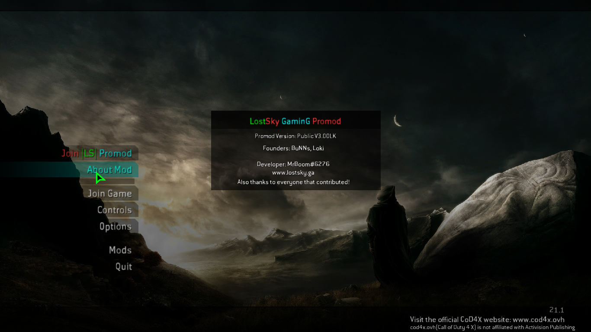
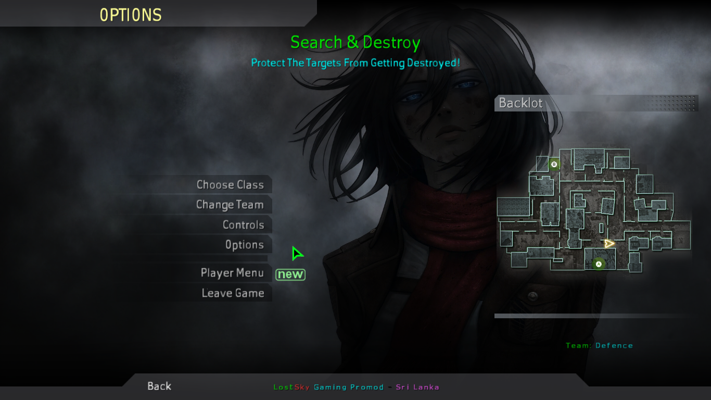
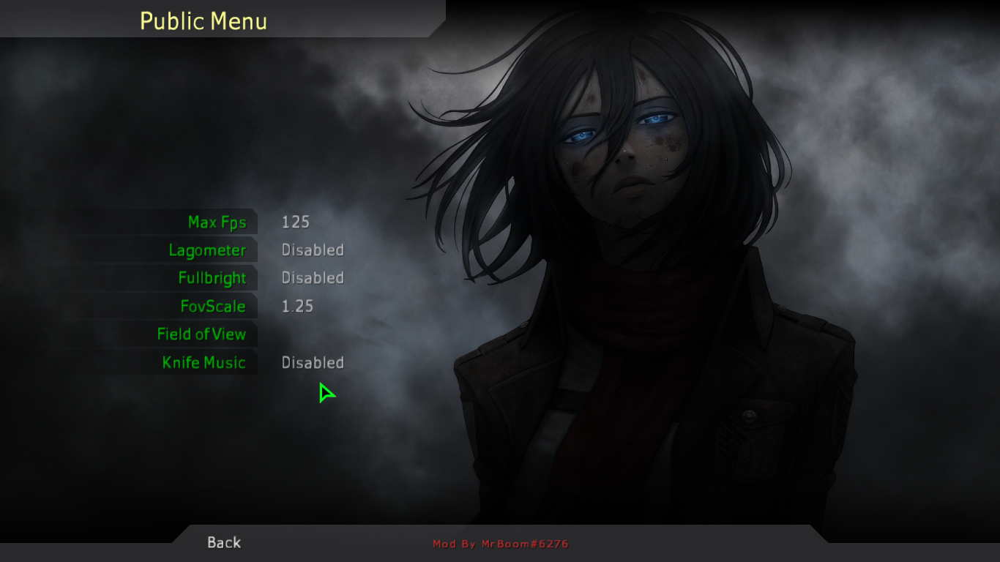
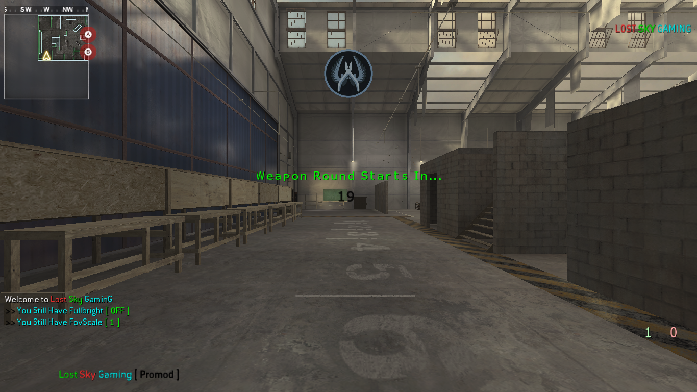
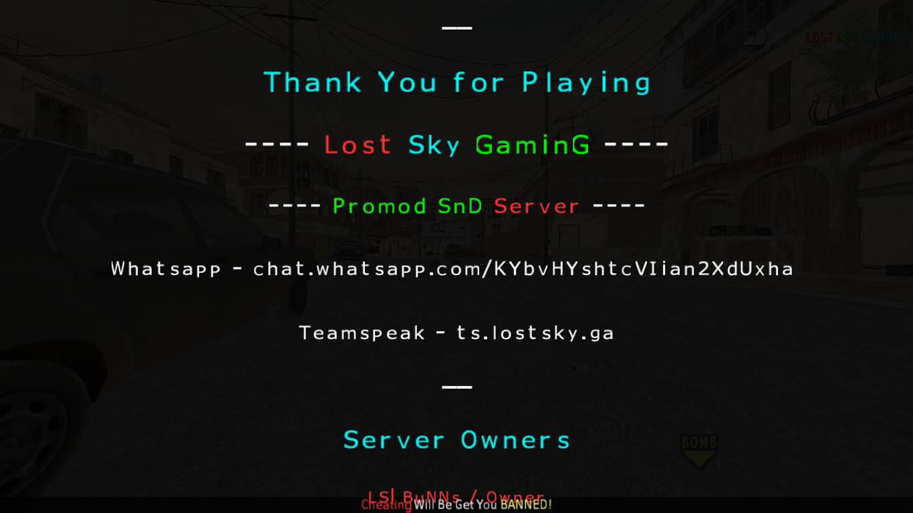

## **LostSky GaminG Promod**


- This Repository Contains Source Code Of LostSky Promod Mod.
- Have a Question Contact Me On Discord @ MrBoom#6276

⚠️ Mostly Known Error ( atleast by me ) : There are Some Error Reguarding "rumble/pistol_fire_h.rmb".

## Features
- Extremely Light Weight ( Suitable For Any Type Of Server )
- Custom UI
- Player Menu
- Flags
- Endround Music
- Mapvote System

## Required Files to Run The Server
```
- ./boom/*
- ./crazy/*
- ./duffman/*
- ./maps/*
- ./promod/*
- ./promod_ruleset/*
- ./*.iwd files
- ./mod.ff
- ./load_languages.gsc
- ./server.cfg
```
## How to Run The Server

```
- You Need [CoD4x Server Files](https://cod4x.ovh/t/releases) To Run This Mod.
- Clone This Mod Into Your Mods Folder "COD4_DIRECTORY/Mods"
- Use runWindows.bat or runLinux.sh to Start a Basic Server With This Mod.
```

## Screenshots






## Credits

Thanks To Everyone Who Contributed To This Mod. This Mod Isn't Fully Written By Me, Special Thanks To,

- Ebc Promod
- Braxi's Deathrun
- Slesports Promod 

*Happy Coding*
